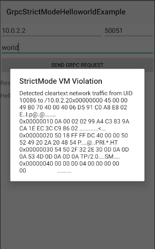

gRPC Android StrictMode Example
========================

- This example intends to show the compatibility of gRPC with Android StrictMode.
- Android SDK version 28 is required for [`StrictMode.VmPolicy.Builder.penaltyListener`](https://developer.android.com/reference/android/os/StrictMode.VmPolicy.Builder.html#penaltyListener(java.util.concurrent.Executor,%20android.os.StrictMode.OnVmViolationListener)) used in the example.
- This example does the same thing as [HelloWorld example](../helloworld) except popping up a dialog for detected StrictMode policy violation (shown below).

